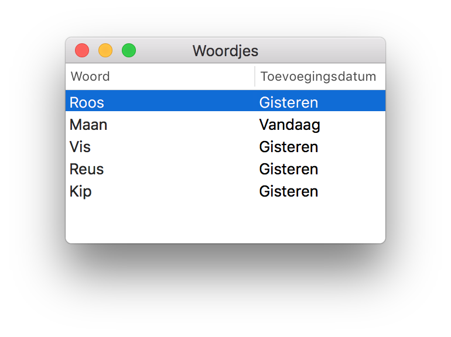

# Features

## iOS app

- View words of a list
- Add words to a list
- Remove words from a list
- Present word in full screen on a second monitor (via AirPlay or HDMI cable)
- Synchronize all words inside a private iCloud database in realtime
- Cache all words locally (eliminating the need to always download all the words on startup)

 

## macOS app

 

- View words in a list
- Edit words
- Delete words
- Synchronize all words inside a private iCloud database in realtime
- Cache all words locally (eliminating the need to always download all the words on startup)
